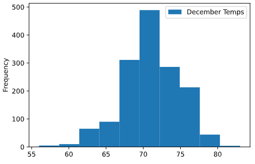

# Surfs_up

## Overview of Analysis

This project is the ninth weekly challenge of the Data Science Bootcamp. It allows us to put into practice and showcase the skills learned in Module 9 of the bootcamp.

### Purpose

An analysis on the temperature trends for the months of June and December is required.  This will help prospective investors to determine if the surf and ice cream shop business is sustainable year-round.

The information requested is:

- A summary of the statistics for the temperatures in June
- A summary of the statistics for the temperatures in December

## Results

Analysis of the input file was carried out in Python 3.7 using a Jupyter Notebook running on VS Code ([SurfsUp_Challenge.ipynb](SurfsUp_Challenge.ipynb)).

The data was obtained from a SQLite file: [hawaii.sqlite](hawaii.sqlite) available for download.

### Deliverable 1: Determine the Summary Statistics for June

After establishing a session to the SQLite file, a query was created to retrieve the temperatures on the month of June of any year.

```python
# 1. Import the sqlalchemy extract function.
from sqlalchemy import extract
# 2. Write a query that filters the Measurement table to retrieve the temperatures for the month of June. 
results = session.query(Measurement.tobs).\
        filter(extract('month',Measurement.date) == 6).all()
#  3. Convert the June temperatures to a list.
temps_june = np.ravel(results)
# 4. Create a DataFrame from the list of temperatures for the month of June. 
temps_june_df = pd.DataFrame(temps_june, columns=['June Temps'])
# 5. Calculate and print out the summary statistics for the June temperature DataFrame.
temps_june_df.describe()
```

### Deliverable 2: Determine the Summary Statistics for December

A very similar query from the previous deliverable was created to retrieve the temperatures on the month of December of any year.

```python
results = session.query(Measurement.tobs).\
        filter(extract('month',Measurement.date) == 12).all()
temps_dec = np.ravel(results)
temps_dec_df = pd.DataFrame(temps_dec, columns=['December Temps'])
temps_dec_df.describe()
```

### Analysis

O'ahu is located at 21.4389° N, as such we would expect the temperature to have low variability year round.  

We can see from the statistics below that this is the case. Namely:

- there is only a 4°F diference in the mean temperature from June (74.9°F) to December (71.0°F).
- the standard deviation of temperatures is also very similar, although slightly larger in December (3.7°F) than in June (3.3°F)
- the maximum temperature in December (83°F) is very close to the maximum in June (85°F)

   

## Summary

The data points to the fact that the temperature between June and December is not very different.  The months of June and December act as proxy for the northen hemisphere's summer and winter seasons.

We can further look at the data and draw other information.

### Histograms

The above points can also be observed in the histogram for both queries. Notice that although the statistics are very similar for both months, the month of June shows a wider distribution.

**Histogram June Temperatures**

 

**Histogram December Temperatures**



The histograms were generated using the following code:

```python
temps_june_df.plot.hist(bins=10)
temps_dec_df.plot.hist(bins=10)
```

### Density Distributions

The temperatures can be easily compared if we look at the density distribution of the temperatures for both months. From the plot below, we can see that the temperatures in the month of June are higher than in the month of December, although not by much as previously stated.

**Temperature - Density Distribution**


The density distributions were generated using the *seaborn* dependency for python and a new query extracting the date and year and month of the data point.

```python
import seaborn as sns
# Query to extract temperature and date information
res = session.query(Measurement.date, Measurement.tobs, 
                    func.extract('month',Measurement.date),
                    func.extract('year',Measurement.date)).\
                    filter(or_(extract('month',Measurement.date) == 6,extract('month',Measurement.date) == 12)).all()
# Create dataframe
res_df = pd.DataFrame(res, columns=['Date','Temperature', 'Month', 'Year'])
# Add month_name column using Lambda function. Used in plotting
res_df['Month_txt'] = res_df.apply(lambda row : 'June' if row['Month'] == 6 else 'December', axis=1)
sns.displot(res_df, x="Temperature", hue='Month_txt', kind='kde')
```

### Temperature Distribution - yearly comparison

An interesting piece of information can be obtained by looking at the temperature distribution changes by year for each month.

As it can be seen in the plots below the distributions for both months has been shifting to higher temperature values over the years.  So, it would be a good guess that the ice-cream business will actually improve over time. 

**Density Distribution - June**


**Density Distribution - December**


```python
sns.displot(res_df.loc[res_df['Month']==6], x="Temperature", hue='Year', kind='kde')
sns.displot(res_df.loc[res_df['Month']==12], x="Temperature", hue='Year', kind='kde')
```